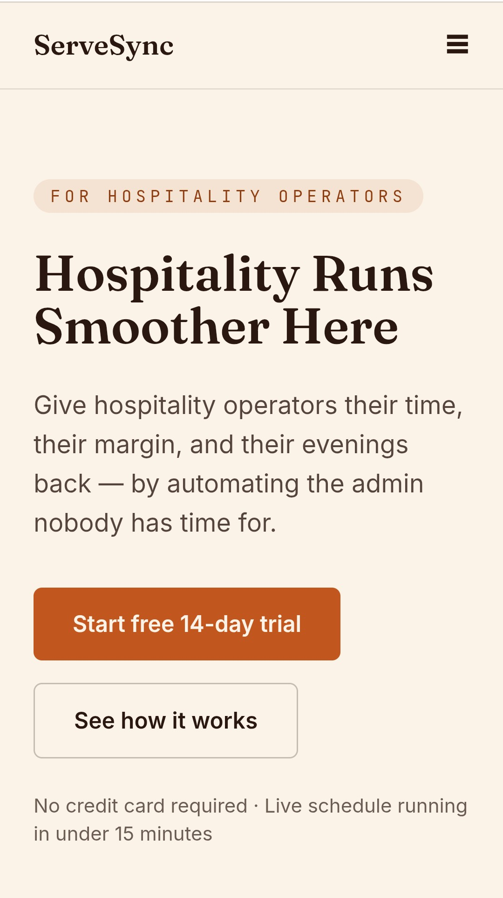

# ServeSync — Project Overview

ServeSync is an AI‑powered back‑office system designed for hospitality operators.  
This repository contains the full codebase for the public landing page and the backend API routes powering early ServeSync features.

This file serves as the `high‑level summary` of the entire project.  
For detailed documentation, refer to the folder‑specific README files.

## Screenshot

## Project Purpose

ServeSync aims to automate the operational workload of restaurants, cafés, bars, and hospitality groups.  
This repository currently includes:

- The official landing page  
- The first backend API endpoints  
- Early integration with Supabase for authentication and data storage  

As the project evolves, additional modules (scheduling, payroll, staff management, forecasting) will be added.

## Tech Stack (High-Level)

- `Frontend:` React, Vite, TypeScript, Tailwind CSS  
- `Backend:` Express (Vercel Serverless Functions)  
- `Database:` Supabase (PostgreSQL + RLS)  
- `Auth:` Supabase Auth  
- `Deployment:` Vercel

## Authentication System

- Supabase Auth  
- Email/password login  
- Password reset  
- Email verification  
- Multi‑tenant RLS  
- Auth Guard  
- Admin Guard  

## Current Status (Summary)

- Full landing page completed  
- Contact form fully functional  
- Supabase RLS configured for multi‑tenant data isolation  
- Authentication system implemented  
- Trial system implemented  
- Dashboard, settings, and admin routes added  

For deeper details, see `/frontend/README.md`.

## Trial System

- 14‑day trial  
- Auto‑activation on first dashboard visit  
- Trial banner  
- Trial lock (redirect to /trial-expired)  
- Trial Expired page  
- Trial columns in profiles table  

## Application Structure

- Landing page (public marketing site)  
- Frontend application (dashboard, settings, admin)  
- Backend API (serverless functions)  
- Supabase database + authentication  

## Subscription System (Upcoming)

- Stripe Checkout integration  
- Stripe Webhooks  
- Subscription status sync  
- Billing history page  
- Subscription cancellation flow  

## Backend Overview

- Serverless API routes  
- Supabase database  
- Row-Level Security (RLS)  
- Profiles table  
- Trial columns  
- Subscription columns (upcoming)  

## Roadmap (High-Level)

### Frontend (Landing Page)
- Testimonials section  
- Dashboard preview section  
- Smooth scroll navigation  
- Active link highlighting  
- Scroll‑triggered animations  
- Multi‑language support  

### Core SaaS
- Subscription system (Stripe)  
- Billing history  
- Business profile page  
- Email verification flow  

### Admin
- User list  
- Extend trial  
- Subscription overview  
- Analytics  

### Operations Modules
- Staff list  
- Staff edit  
- Staff delete  
- Scheduling module  

## End‑Project Considerations

This file will be updated as ServeSync grows.  
It will include:

- Architecture decisions  
- Module summaries  
- Final project documentation  
- Release notes for major versions  

For implementation‑level details, refer to the frontend and API READMEs.

## Author

Yoichi dev