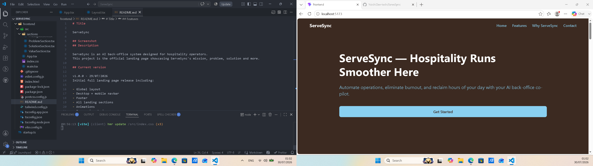

# Title

ServeSync

## Screenshot

## Description

ServeSync is an AI back-office system designed for hospitality operators.
This project is the official landing page showcasing ServeSync's mission, problem, solution and more.

## Current version

v1.0.0 - 29/07/2026
Initial full landing page release including:

- Global layout
- Desktop + mobile navbar
- Footer
- All landing sections
- Animations
- Responsive design
- Vercel‑ready deployment

## Features

- Hero section
- Problem section
- Solution section
- Features section
- Value section
- Pricing section
- FAQ section
- Contact section
- CTA section
- Mobile navigation
- Global layout wrapper
- Smooth animations (fade‑in + slide‑up)

## Tech stack

- React
- Vite
- Typescript
- Tailwind CSS
- Supabase

## Bugs (on current commit)

None

## Future improvements

- Add testimonials section
- Add dashboard preview section
- Add smooth scroll navigation
- Add active link highlighting
- Add animations triggered on scroll
- Add multi‑language support
- Stripe Checkout integration
- Stripe Webhooks
- Subscription status sync
- Billing history page
- Subscription cancellation
- Admin analytics
- Extend trial feature
- Business profile page
- Multi-tenant support

## Author

Yoichi dev

## Changelog - 20/08/2026
### Trial
- 14‑day free trial
- Automatic trial activation on first dashboard visit
- Trial banner
- Trial expiration lock
- Trial Expired page
- Redirect behavior

### Authentication and Guards
- Auth Guard (protects dashboard)
- Admin Guard (protects admin routes)
- Trial Lock (protects dashboard after expiration)
- Email + password update flow
- Supabase integration

### New Pages

### User Settings
- Email update
- Password update
- Supabase auth update
- Security considerations

### Dashboard Enhancement
- Trial banner
- Logout button
- Clean layout
- Auth guard
- Trial lock